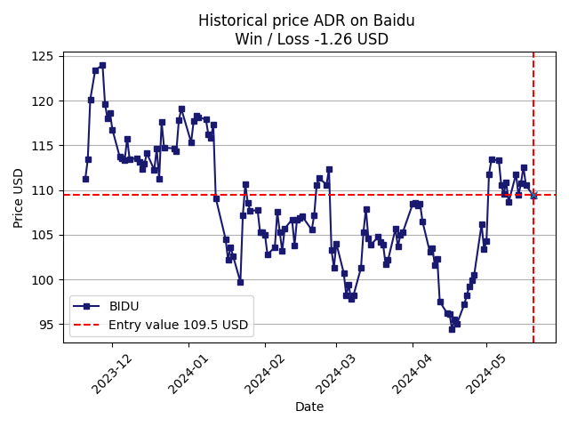

# 📊 Portfolio Finance Analysis

This Python project provides tools to analyze the performance of a financial portfolio by tracking earnings/losses, points of entry, and visualizing the performance of individual investments.

## 🔍 Overview

The goal of this project is to build a Python-based analytical tool that:
- Tracks individual trades/investments
- Calculates earnings and losses
- Identifies point-of-entry data for each investment
- Visualizes each earning/loss via line plots

## 🚀 Features

- ✅ Import your portfolio (JSON)
- 📈 Plot performance graphs per asset
- 💹 Calculate total and per-asset P&L (profit/loss)
- 🔁 Support for ongoing portfolio updates
- 📊 Summary dashboard (coming soon)

## 🛠️ Tech Stack

<!-- - Python 3.9+
- Pandas (data manipulation)
- Matplotlib / Plotly (visualization)
- Jupyter Notebooks (optional, for exploration)
- [Optional] Alpaca, yFinance, or similar APIs for live data -->

## 📦 Installation

```bash
git clone https://github.com/DevGuit/Finance-script
cd portfolio-finance-analysis
pip install -r requirements.txt
```

## 🧪 Usage

1. **Prepare your data**  
   Add your portfolio data to `portfolio/Portfolio.csv`. Required columns:
   - `Asset`, `Date`, `Type` (Buy/Sell), `Price`, `Quantity`

2. **Run analysis**
   ```bash
   python main.py
   ```

3. **Visualize earnings**
   Outputs will be saved to `charts/` directory.

<!-- 4. **Example Jupyter Notebook**
   Open `notebooks/Portfolio_Analysis.ipynb` for an interactive walkthrough. -->

## 📉 Sample Output



*Sample earnings graph with point-of-entry marked*

## 🗂️ Directory Structure

<!-- ```
portfolio-finance-analysis/
│
├── data/                 # Raw data files
├── outputs/              # Generated plots and reports
├── notebooks/            # Jupyter notebooks for interactive analysis
├── src/                  # Core Python scripts
│   ├── analysis.py       # Main logic
│   └── plot_utils.py     # Visualization tools
├── analyze.py            # CLI entry point
├── requirements.txt
└── README.md
``` -->

## 📌 Roadmap

<!-- - [ ] Add support for dividend tracking
- [ ] Include risk metrics (Sharpe ratio, beta)
- [ ] Build a web dashboard (Streamlit) -->

## 🤝 Contributing

Pull requests are welcome. For major changes, please open an issue first to discuss your ideas.
